# Contributing to Solana Escrow Program

Thank you for your interest in contributing to the Solana Escrow Program! We welcome contributions from developers of all skill levels. This document provides guidelines for contributing to the project.

## 🚀 Quick Start

1. **Fork** the repository
2. **Clone** your fork locally
3. **Create** a new branch for your feature/fix
4. **Make** your changes
5. **Test** your changes thoroughly
6. **Submit** a pull request

## 📋 Table of Contents

- [Code of Conduct](#code-of-conduct)
- [Getting Started](#getting-started)
- [Development Setup](#development-setup)
- [Making Changes](#making-changes)
- [Testing Guidelines](#testing-guidelines)
- [Submitting Changes](#submitting-changes)
- [Review Process](#review-process)
- [Community](#community)

## 📜 Code of Conduct

This project adheres to a [Code of Conduct](CODE_OF_CONDUCT.md). By participating, you are expected to uphold this code. Please report unacceptable behavior to [conduct@0x-professor.dev].

## 🎯 Getting Started

### Types of Contributions

We welcome several types of contributions:

- 🐛 **Bug Reports**: Help us identify and fix issues
- 🔧 **Bug Fixes**: Submit fixes for known issues  
- ✨ **New Features**: Propose and implement new functionality
- 📚 **Documentation**: Improve or add documentation
- 🧪 **Tests**: Add or improve test coverage
- 🎨 **Code Quality**: Refactoring, optimization, cleanup
- 🔐 **Security**: Security improvements and audits

### Areas for Contribution

**High Priority**:
- Test coverage improvements
- Security audit and fixes
- Performance optimizations
- Documentation improvements

**Medium Priority**:
- New instruction types
- Enhanced error handling
- Client SDK development
- Integration examples

**Nice to Have**:
- Multi-token escrows
- Time-locked escrows
- Fee mechanisms
- UI/UX tools

## 🛠️ Development Setup

### Prerequisites

- **Rust** 1.70+ with `cargo`
- **Solana CLI** 1.18+
- **Git** for version control
- **Node.js** (for client testing)

### Environment Setup

```bash
# Clone your fork
git clone https://github.com/YOUR-USERNAME/Escrow-Program-Solana.git
cd Escrow-Program-Solana

# Install Solana CLI tools
sh -c "$(curl -sSfL https://release.solana.com/v1.18.14/install)"

# Install BPF toolchain
cargo install solana-platform-tools

# Set up Solana for development
solana config set --url localhost

# Build the program
cargo build-sbf

# Run tests
cargo test
```

### IDE Setup

**VS Code Extensions**:
- `rust-analyzer`: Rust language support
- `Solana`: Solana development tools
- `Better TOML`: TOML file support

**Vim/Neovim**:
- Configure LSP with `rust-analyzer`
- Use `solana-vim` plugin for syntax highlighting

## 🔄 Making Changes

### Branch Naming

Use descriptive branch names with prefixes:

```bash
# Features
git checkout -b feature/add-multi-token-support
git checkout -b feature/time-locked-escrows

# Bug fixes
git checkout -b fix/rent-exemption-check
git checkout -b fix/integer-overflow-issue

# Documentation
git checkout -b docs/update-readme
git checkout -b docs/add-architecture-guide

# Refactoring
git checkout -b refactor/simplify-processor
git checkout -b refactor/optimize-account-validation
```

### Commit Messages

Follow conventional commit format:

```
type(scope): description

[optional body]

[optional footer]
```

**Types**:
- `feat`: New feature
- `fix`: Bug fix
- `docs`: Documentation changes
- `style`: Code style changes (formatting, etc.)
- `refactor`: Code refactoring
- `test`: Adding or modifying tests
- `chore`: Maintenance tasks

**Examples**:
```bash
feat(processor): add support for multiple SPL tokens

- Implement multi-token validation logic
- Update escrow state structure
- Add comprehensive tests for new functionality

Closes #123

fix(security): prevent integer overflow in amount calculation

- Use checked arithmetic operations
- Add proper error handling
- Include regression test

Security issue reported by @security-researcher
```

### Code Style

#### Rust Guidelines

- **Formatting**: Use `rustfmt` (automatically applied)
- **Linting**: Address all `clippy` warnings
- **Naming**: Follow Rust naming conventions
- **Comments**: Use `///` for public API documentation

```rust
/// Processes the escrow initialization instruction
/// 
/// # Arguments
/// 
/// * `accounts` - The accounts required for escrow initialization
/// * `amount` - The expected amount in lamports
/// * `program_id` - The program's public key
/// 
/// # Errors
/// 
/// Returns `EscrowError::InvalidOwner` if token account ownership is invalid
pub fn process_init_escrow(
    accounts: &[AccountInfo],
    amount: u64,
    program_id: &Pubkey,
) -> ProgramResult {
    // Implementation
}
```

#### Security Guidelines

- Always validate account ownership
- Use checked arithmetic operations
- Implement proper error handling
- Add security-focused comments for complex logic

```rust
// Security: Verify the temp token account is owned by the initializer
// to prevent unauthorized token deposits
if temp_token_account_info.owner != *initializer.key {
    return Err(EscrowError::InvalidOwner.into());
}

// Security: Use checked addition to prevent integer overflow
let total_amount = base_amount
    .checked_add(fee_amount)
    .ok_or(EscrowError::ArithmeticOverflow)?;
```

## 🧪 Testing Guidelines

### Test Categories

1. **Unit Tests**: Test individual functions
2. **Integration Tests**: Test instruction processing
3. **Security Tests**: Test attack vectors
4. **Performance Tests**: Benchmark critical paths

### Writing Tests

```rust
#[cfg(test)]
mod tests {
    use super::*;
    
    #[test]
    fn test_escrow_initialization_success() {
        // Arrange
        let mut escrow = Escrow::default();
        let initializer_key = Pubkey::new_unique();
        let expected_amount = 1000;
        
        // Act
        escrow.is_initialized = true;
        escrow.initializer_pubkey = initializer_key;
        escrow.expected_amount = expected_amount;
        
        // Assert
        assert!(escrow.is_initialized());
        assert_eq!(escrow.initializer_pubkey, initializer_key);
        assert_eq!(escrow.expected_amount, expected_amount);
    }
    
    #[test]
    fn test_escrow_initialization_prevents_double_init() {
        // Test double initialization prevention
    }
}
```

### Running Tests

```bash
# Run all tests
cargo test

# Run specific test
cargo test test_escrow_initialization

# Run tests with output
cargo test -- --nocapture

# Run integration tests
cargo test-sbf
```

### Test Coverage

Aim for high test coverage:

- **Critical paths**: 100% coverage
- **Error handling**: 100% coverage  
- **Overall project**: >90% coverage

```bash
# Generate coverage report (requires tarpaulin)
cargo install cargo-tarpaulin
cargo tarpaulin --out html
```

## 📝 Documentation

### Code Documentation

- Document all public APIs with `///`
- Include examples in documentation
- Document error conditions
- Explain complex logic with inline comments

### README Updates

When adding features, update:

- Feature list
- Usage examples
- Architecture diagrams
- Performance metrics

### Additional Documentation

Create new documentation files for:

- **Architecture decisions** (`docs/architecture/`)
- **Integration guides** (`docs/integration/`)
- **Performance analysis** (`docs/performance/`)

## 🚀 Submitting Changes

### Pre-submission Checklist

Before submitting a PR:

- [ ] All tests pass (`cargo test`)
- [ ] Code follows style guidelines (`cargo fmt`, `cargo clippy`)
- [ ] Documentation is updated
- [ ] Security considerations addressed
- [ ] No breaking changes (or properly documented)
- [ ] Commit messages follow convention
- [ ] Branch is up to date with main

### Pull Request Process

1. **Create PR** with descriptive title and description
2. **Link issues** that the PR addresses
3. **Add reviewers** (maintainers will be auto-assigned)
4. **Respond to feedback** promptly and professionally
5. **Update branch** if requested
6. **Celebrate** when merged! 🎉

### PR Template

```markdown
## Description
Brief description of changes made.

## Type of Change
- [ ] Bug fix (non-breaking change which fixes an issue)
- [ ] New feature (non-breaking change which adds functionality)
- [ ] Breaking change (fix or feature that would cause existing functionality to not work as expected)
- [ ] Documentation update

## Testing
Describe the tests you ran and how to reproduce them.

## Security Considerations
Describe any security implications of your changes.

## Checklist
- [ ] My code follows the style guidelines
- [ ] I have performed a self-review
- [ ] I have commented my code, particularly in hard-to-understand areas
- [ ] I have made corresponding changes to the documentation
- [ ] My changes generate no new warnings
- [ ] I have added tests that prove my fix is effective or that my feature works
- [ ] New and existing unit tests pass locally with my changes
```

## 👥 Review Process

### Review Timeline

- **Initial response**: Within 48 hours
- **Full review**: Within 1 week
- **Follow-up reviews**: Within 24-48 hours

### Review Criteria

Reviewers will check:

- **Functionality**: Does the code work as intended?
- **Security**: Are there security vulnerabilities?
- **Performance**: Is the code performant?
- **Style**: Does it follow project conventions?
- **Tests**: Are there adequate tests?
- **Documentation**: Is documentation complete and accurate?

### Addressing Feedback

- Respond to all feedback, even if just to acknowledge
- Ask questions if feedback is unclear
- Make requested changes in additional commits
- Update the PR description if scope changes

## 🏆 Recognition

Contributors are recognized in several ways:

- **README acknowledgments**: Major contributors listed in README
- **Release notes**: Contributors credited in release announcements  
- **Discord roles**: Special roles for active contributors
- **Maintainer status**: Outstanding contributors may be invited as maintainers

## 🤝 Community

### Communication Channels

- **GitHub Discussions**: General discussion and Q&A
- **GitHub Issues**: Bug reports and feature requests
- **Discord**: Real-time chat (link in README)
- **Email**: Direct contact for sensitive matters

### Getting Help

If you need help:

1. Check existing documentation
2. Search GitHub issues and discussions
3. Ask in GitHub Discussions
4. Join our Discord community
5. Reach out to maintainers directly

### Mentorship

New contributors can request mentorship:

- **Code reviews**: Get detailed feedback on your contributions
- **Pair programming**: Work directly with experienced contributors
- **Issue guidance**: Get help choosing appropriate issues to work on

## 📊 Contribution Workflow

```mermaid
graph LR
    A[Fork Repo] --> B[Create Branch]
    B --> C[Make Changes]
    C --> D[Write Tests]
    D --> E[Run Tests]
    E --> F{Tests Pass?}
    F -->|No| C
    F -->|Yes| G[Create PR]
    G --> H[Code Review]
    H --> I{Approved?}
    I -->|No| J[Address Feedback]
    J --> H
    I -->|Yes| K[Merge PR]
    K --> L[Celebrate! 🎉]
```



## ❓ FAQ

### How do I get started?

Look for issues labeled `good first issue` or `help wanted`. These are specifically chosen to be newcomer-friendly.

### What if I break something?

Don't worry! That's what testing and code review are for. We have comprehensive CI/CD that will catch most issues.

### How long do reviews take?

We aim to provide initial feedback within 48 hours. Complex changes may take longer.

### Can I work on multiple PRs at once?

Yes, but we recommend focusing on one significant change at a time for better quality.

### What if my PR conflicts with other changes?

We'll help you resolve conflicts. Don't hesitate to ask for assistance.

---

Thank you for contributing to the Solana Escrow Program! Every contribution, no matter how small, helps make the project better for everyone.

**Happy coding!** 🚀
